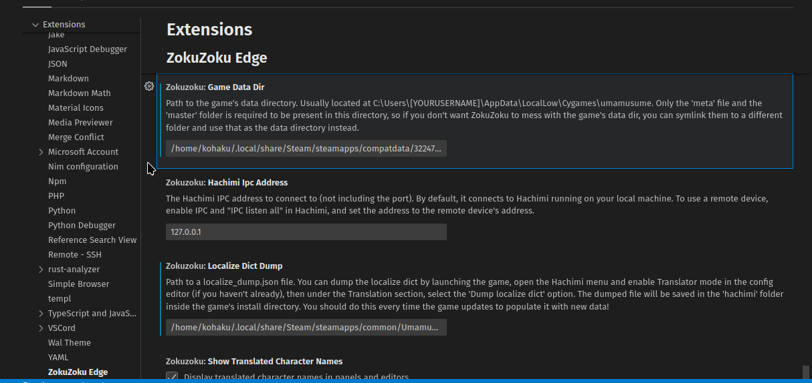

# Guidelines for Contribution
Kamusta! Thanks for taking the time for contributing to this project!
This project aims to translate the honse game to the Filipino language
as best as it can. Before you get started, here are some things
you should know first:

## Tools
You should get familiar on how to translate Hachimi-based translation
projects. [This page][1] can help you get started. Of course, you
need to have UM:PD installed on your system to use it.

## Machine Translation
It's okay for you to use machine translation if you get stuck, but
I encourage that you try your raw Filipino translation skills. You
can use it for reference/guidance and seeing if your translation
typed by hand closely or exactly matches the original string.

## Writing Style
You may use informal tone or slangs when translating strings
depending on the character or story flow (such as talking to the
Uma in the home screen, stories, career events, etc).

An example scenario would be how Gold Ship would speak. You can use
informal tone / slangs for that. If it is Daiwa Scarlet or 
Air Groove for instance, then formal language is recommended.

You may use "Taglish" instead of full Tagalog/Filipino,
as pure Tagalog can be a bit weird and stiff, and in most cases
defragment from the string or sentence's context

## Keep it short if possible
There are cases where text may get cut off. This unfortunately
is a limitation on the game itself (blame Cy for that), so if
possible, try making the character length short.

## Breaks are fine
You don't have to translate lots of strings in one go. This is
a project purely based on collaboration, so you can just leave
your contribution and wait for the others to translate more
strings.

## Handling occurrences of `\n`
If you use ZokuZoku Edge then you may encounter `\n` characters
in the source strings. Please do not type them directly (
or they will show up in game instead of newlines), but instead
create a new line as you would (by pressing Enter, of course)

# Okay! I understand, now how do I get started?!?
This is pretty easy to do, just follow these "simple" steps:

0. [Read Hachimi's translation guide first][1]
1. Download the global version of UM:PD on Steam (if not already)
2. [Install Hachimi][2], open the game and close the welcome dialog
(we don't need to set it up)
3. Go through setting up the game and download the
required assets (IMPORTANT)
4. Press the `Right arrow`, go to settings then enable
`Translator Mode` and `Enable IPC`
5. On the same left overlay UI, click on `Dump localize dict`
6. Download [VSCode][3] or [VSCodium][4], whatever you prefer, if not already
7. Clone this repository using `git`:
```
git clone https://codeberg.org/kita/hachimi-fil-glb
```
9. Open the cloned folder/repo in VSCode, then install the suggested
extensions when prompted
10. If prompted by ZokuZoku Edge to install dependencies, press OK.
11. It will then auto-detect where the game is installed and ask you
if you use Linux or you stored the game somewhere else, continue with these steps
12. Open the Settings by clicking the cog at the bottom right, then click `Settings` or press `CTRL+`
13. Scroll down until you find this section:

14. Change the `Game Data dir` and `Localize Dict Dump` to their appropriate values. For Linux, these are
the paths, unless you put them in a different drive:
```
(Convert 0x3134c2 from hex)
Game Data dir: /home/your_username/.local/share/Steam/steamapps/compatdata/0x3134c2/pfx/drive_c/users/steamuser/AppData/LocalLow/CG/UM
Localize Dict Dump: /home/your_username/.local/share/Steam/steamapps/common/UMPD/hachimi/localize_dump.json
```
15. Now you're done! Just find the carrot icon on the left sidebar and start translating!


[1]: https://hachimi.noccu.art/docs/translation-guide/welcome
[2]: https://hachimi.noccu.art/docs/hachimi/installing-windows
[3]: https://code.visualstudio.com
[4]: https://vscodium.com
