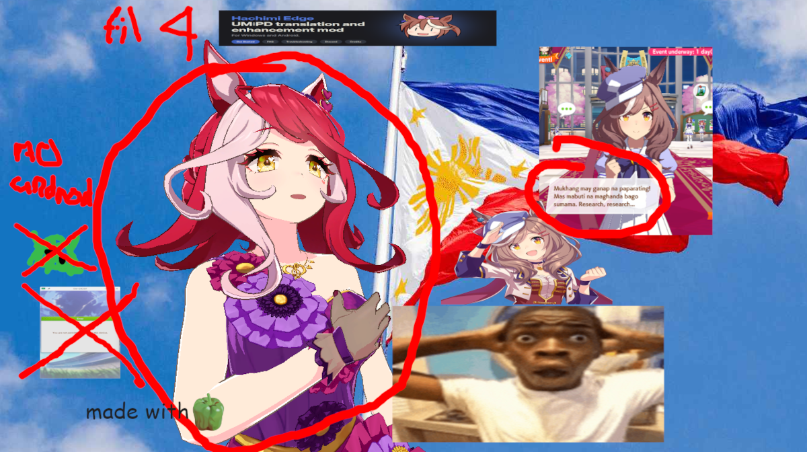

 

# Fan-made Filipino Translations for Honse Game (Global)

This is an effort of mine to translate the global version of honse
game to the Filipino language.

# A word of warning

> *This notice is partially based of the Hachimi project's warning.*

We understand that you want to share this project to other fellow
Filipinos for them to try or even laugh at it (there's a lot of 
Filipino UM:PD fans actually), but this project, along with
the Hachimi project, violates the game's Terms of Service, and they
would most likely want this project gone if they find out.

While sharing on low profile, preferably end to end encrypted
services (such as Matrix, XMPP, Signal, or similar) or in the darknet
are fine, we ask that you refrain from sharing links to this project
on public facing websites, especially Facebook.

## If you're gonna share it anyways
If you must, go ahead anyway, but masquerade the game to something
less obvious such as *UM:PD* or *honse game* to reduce the
visibility of this project and indexing of this project to search
engines or detection by AI.

# Progress of this project
It is incomplete but slowly coming together. Text in atlases/images,
careers, etc. are of course not translated yet.

# How to use
> [!NOTE]
>
> If you use Android, you're out of luck lmao

If you use translator mode in Hachimi then you can try it out
yourself. If you are a regular user wanting to use it, well... you
can't lol, because the metadata for it doesn't exist yet.

# Contribute
Read the [Contribution Guidelines](./Contributing.md) before you
spend all your blood, sweat and tears contributing to this project.
Thanks :3

# License
This project is licensed under the Modified BSD License ("BSD-3-Clause"), with additional terms
prohibiting AI training. You may not use or contribute to this project without agreement to the terms.
