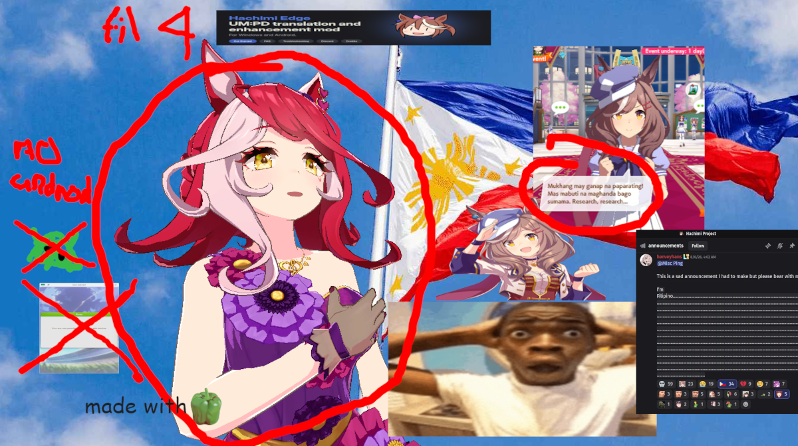
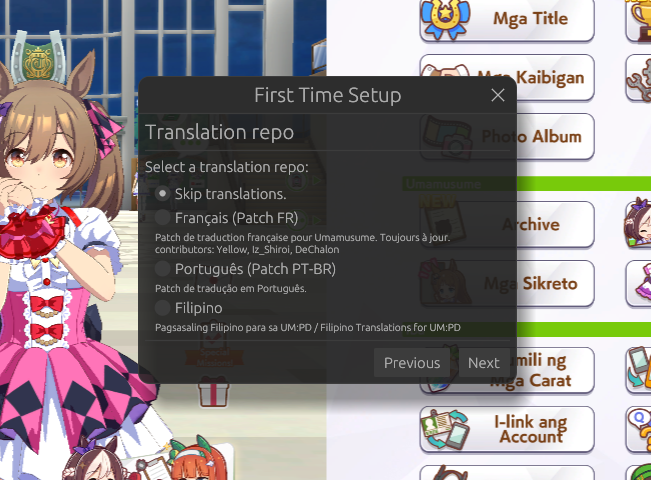

 

# Fan-made Filipino Translations for Honse Game (Global)

This is an effort of mine to translate the global version of honse
game to the Filipino language.

> [!WARNING]
>
> This inherently violates Cygames' Terms of Service. Use of this
> project is at your own risk, we will not responsible for
> banned accounts.
>
> While they have never taken action against the usage of translation
> tools and harmless mods so far, we cannot guarantee it will be the
> same case in the future!

For those wanting to spread the word

  

> *This notice is partially based of the Hachimi project's warning.*

We understand that you want to share this project to other fellow
Filipinos for them to try or even laugh at it (there's a lot of 
Filipino UM:PD fans actually), but this project, along with
the Hachimi project, violates the game's Terms of Service, and they
would most likely want this project gone if they find out.

While sharing on low profile, preferably end to end encrypted
services (such as Matrix, XMPP, Signal, or similar) or in the darknet
are fine, we ask that you refrain from sharing links to this project
on public facing websites, especially Facebook.

## If you're gonna share it anyways
If you must, go ahead anyway, but masquerade the game to something
less obvious such as *UM:PD* or *honse game* to reduce the
visibility of this project and indexing of this project to search
engines or detection by AI.

# Progress of this project
It is incomplete but slowly coming together. Text in atlases/images,
careers, etc. are of course not translated yet.

# How to use
> [!NOTE]
>
> If you use Android, you're out of luck lmao

If you want to look at this abomination, you can. Simply install
[Hachimi][1] and select Filipino as the preferred language
in the translations selection during setup:

# Contribute
Read the [Contribution Guidelines](./Contributing.md) before you
spend all your blood, sweat and tears contributing to this project.
Thanks :3

# License and Data Usage

Copyright (c) 2026 Vyxie and the Filipino Hachimi Translation Project
(UmaFIL) contributors.

All rights reserved.

Unless otherwise noted, all content in this repository is licensed
under a modified version of the 3-Clause BSD License, with modifications
that explicitly prohibit the usage of all data (including but not limited
to texts, images,atlases, source code and other assets) for Large Language
Model training, generative AI and any similar activity.

You are free to use the data and translations for any purpose (such
as website frontends, community projects, data repositories,
commentaries, derivatives and the like), provided that you provide clear
attribution, license and copyright notices as well as warranty
disclaimers (which is mandated by the original 3-Clause BSD License)
and not use the data for anything that involves AI or Large Language
Model training.

You might say that this may be way too strict, to the point it might
not be an open license anymore, but this is to protect the rights
and integrity of this project.

All original assets and texts are under the copyright of Cygames, Inc.
Cygames and Umamusume are (registered) trademarks of Cygames, Inc.

[1]: https://hachimi.noccu.art
